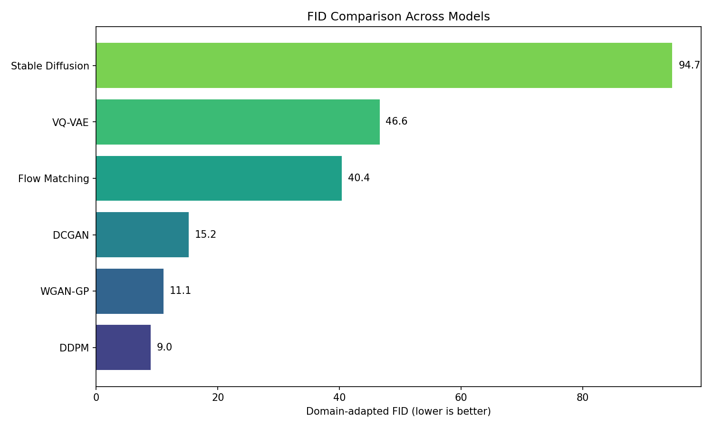
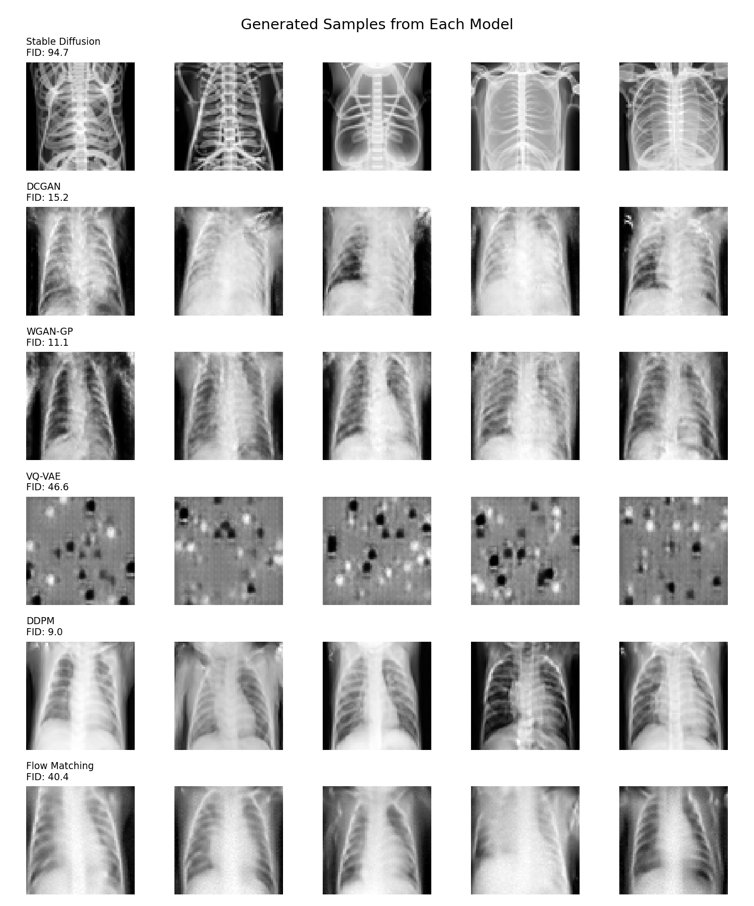

# Fake Dataset Factory
### Synthetic Medical Chest X-Ray Generation — CSET419 GenAI Project

[](https://www.kaggle.com/lakshyarathi)
[](https://www.kaggle.com/datasets/lakshyarathi/lungpp)
[](https://huggingface.co/spaces)

> Generate labeled synthetic chest X-rays using 6 generative architectures spanning 2014–2022.
> Evaluate each model individually. Export a usable dataset. Compare them honestly.

---

## What It Does

Real chest X-ray data is expensive, private, and class-imbalanced.  
This tool generates synthetic labeled chest X-ray images using multiple generative AI approaches — and then actually measures if the synthetic data is any good.

**Input:** pick a model, pick a class (Normal / Pneumonia), pick how many images  
**Output:** `images/` + `labels.csv` + `metrics.json` — ready to plug into any classifier

---

## Architecture



```
  Kaggle Chest X-Ray Dataset
  (train/NORMAL + train/PNEUMONIA)
           │
           ▼
    resize → 64×64 grayscale
           │
     ┌─────┴─────┐
     ▼           ▼
  normal/     pneumonia/    ← class-wise independent training
     └─────┬─────┘
           ▼
  ┌──────────────────────────────────────────────────┐
  │               6 Generation Engines               │
  │                                                  │
  │  SD (img2img) │ DCGAN  │ WGAN-GP │ VQ-VAE        │
  │                  DDPM  │ Flow Matching            │
  └──────────────────────────────────────────────────┘
           │  100 synthetic images per model
           ▼
  ┌──────────────────────────────────────────────────┐
  │         torchxrayvision DenseNet121              │
  │    pretrained on NIH + CheXpert + MIMIC          │
  │                                                  │
  │   domain-adapted FID    +    proxy TSTR          │
  │   (DenseNet121 features)    (Lung Opacity)       │
  └──────────────────────────────────────────────────┘
           │
           ▼
  images/ + labels.csv + metrics.json → ZIP
           │
           ▼
    Gradio UI → HuggingFace Spaces
    (auto-detects available models)
```

---

## The 6 Models

| Model | Year | What Makes It Different |
|---|---|---|
| Stable Diffusion | 2022 | prompt-based img2img, no training needed |
| DCGAN | 2014 | baseline GAN, BCE loss |
| WGAN-GP | 2017 | stable GAN, Wasserstein + gradient penalty |
| VQ-VAE | 2017 | discrete codebook, sharper than vanilla VAE |
| DDPM | 2020 | diffusion model, **best quality** |
| Flow Matching | 2022 | newest, straight-path transport |

Each model trained on the same dataset. Same evaluation. Apples to apples (except SD — documented).

---

## Results

| Model | Year | FID ↓ | TSTR (Lung Opacity) ↑ | Notes |
|---|---|---|---|---|
| **DDPM** | 2020 | **8.96** | 100% | 🥇 Best overall |
| WGAN-GP | 2017 | 11.10 | 100% | 🥈 Stable training |
| DCGAN | 2014 | 15.24 | 100% | 🥉 Strong baseline |
| Flow Matching | 2022 | 40.35 | 100% | OT-CFM, 50 epochs |
| VQ-VAE | 2017 | 46.59 | 100% | No PixelCNN prior* |
| Stable Diffusion | 2022 | 94.71 | 100% | img2img mode** |

\* VQ-VAE uses random codebook sampling — proper generation requires PixelCNN prior on learned indices.

\*\* SD img2img uses real images as input, not pure noise. High FID reflects different input distribution by design.

### FID Comparison



### Generated Samples



---

## Evaluation

**Domain-adapted FID** — DenseNet121 features from `torchxrayvision` instead of Inception V3 (trained on ImageNet). Medically meaningful comparison.

**Proxy TSTR** — generated images scored by pretrained torchxrayvision classifier. `Lung Opacity > 0.5` = synthetic image carries medically plausible features. Lung Opacity used over strict Pneumonia label because generative models learn visual patterns, not clinical diagnoses.

```python
import torchxrayvision as xrv
model = xrv.models.DenseNet(weights="densenet121-res224-all")
# pretrained on NIH + CheXpert + MIMIC + OpenI + Kaggle
```

---

## Dataset

**Source:** [paultimothymooney/chest-xray-pneumonia](https://www.kaggle.com/datasets/paultimothymooney/chest-xray-pneumonia) (Kaggle, free)

**Preprocessed:** [lakshyarathi/lungpp](https://www.kaggle.com/datasets/lakshyarathi/lungpp) (64×64 grayscale, ready to use)

```
chest_xray/
  train/
    NORMAL/      1341 images
    PNEUMONIA/   3875 images
  test/
    NORMAL/       234 images   ← TSTR testing
    PNEUMONIA/    390 images
```

Local path: `chest_xray/` or Kaggle: `/kaggle/input/chest-xray-pneumonia/chest_xray/`

---

## Project Structure

```
fake-dataset-factory/
├── notebooks/
│   ├── 01_stable_diffusion.ipynb
│   ├── 02_dcgan.ipynb
│   ├── 03_wgan_gp.ipynb
│   ├── 04_vqvae.ipynb
│   ├── 05_ddpm.ipynb
│   ├── 06_flow_matching.ipynb
│   ├── 07_comparison.ipynb
│   └── outputs/
│       ├── 01_stable_diffusion/    ← images, labels.csv, metrics.json
│       ├── 02_dcgan/
│       ├── 03_wgan_gp/
│       ├── 04_vqvae/
│       ├── 05_ddpm/
│       ├── 06_flow_matching/
│       ├── combined_metrics.json   ← all models compared
│       └── comparison_table.csv
├── data/
│   ├── prepare.ipynb
│   ├── normal/                     ← preprocessed 64×64
│   └── pneumonia/
├── src/
│   ├── models/
│   ├── evaluate.py
│   ├── label.py
│   └── export.py
├── app.py                          ← Gradio UI
└── README.md
```

---

## Kaggle Notebooks

All notebooks run on Kaggle T4 GPU (free tier). Training time per model: 10-30 min.

| Notebook | Kaggle Link |
|---|---|
| 01_stable_diffusion | [Run on Kaggle](https://www.kaggle.com/code/lakshyarathi) |
| 02_dcgan | [Run on Kaggle](https://www.kaggle.com/code/lakshyarathi) |
| 03_wgan_gp | [Run on Kaggle](https://www.kaggle.com/code/lakshyarathi) |
| 04_vqvae | [Run on Kaggle](https://www.kaggle.com/code/lakshyarathi) |
| 05_ddpm | [Run on Kaggle](https://www.kaggle.com/code/lakshyarathi) |
| 06_flow_matching | [Run on Kaggle](https://www.kaggle.com/code/lakshyarathi) |
| 07_comparison | [Run on Kaggle](https://www.kaggle.com/code/lakshyarathi) |

---

## Install

```bash
pip install torch torchvision diffusers transformers accelerate
pip install torchcfm torchxrayvision pytorch-fid gradio
```

GPU recommended. All notebooks run on Kaggle T4 (free, 30hr/week).

---

## Run

```bash
python app.py
```

Or run any notebook independently — each is self-contained, saves to `outputs/<model_name>/`.  
Gradio app auto-detects which models are trained and enables them.

---

## References

- WGAN-GP on chest X-rays: MDPI 2023
- VQ-VAE on CheXpert: [kamenbliznashki/generative_models](https://github.com/kamenbliznashki/generative_models)
- Flow Matching for medical imaging: [arxiv 2503.00266](https://arxiv.org/abs/2503.00266) (March 2025)
- torchxrayvision: [mlmed/torchxrayvision](https://github.com/mlmed/torchxrayvision)

---

## Author

**Lakshya Rathi** — [Kaggle](https://www.kaggle.com/lakshyarathi)

*CSET419 — Introduction to Generative AI*
